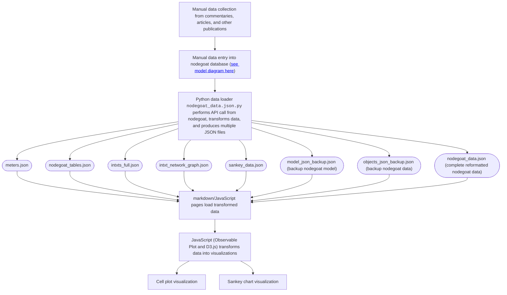

# Visualizing Intertextuality

Website: https://dkrasne.github.io/visualizing-intertextuality/

A project to visualize intertextuality in Latin poetry, using [nodegoat](https://nodegoat.net/) and [Observable Framework](https://observablehq.com/framework/).

## Structure of this repository

Any files not listed below are part of the Observable Framework setup or are solely for local testing purposes.

```ini
.
├─ src
│  ├─ data
│  │  ├─ nodegoat_data.json.py		# a data loader written in Python
│  │  ├─ intxt_network_graph.json	# NetworkX graph data (output by nodegoat_data.json.py)
│  │  ├─ intxts_full.json		# all intertexts (output by nodegoat_data.json.py)
│  │  ├─ meters.json			# information on Latin meters (output by nodegoat_data.json.py)
│  │  ├─ model_json_backup.json		# backup of the nodegoat model structure in case API call fails (output by nodegoat_data.json.py)
│  │  ├─ nodegoat_tables.json		# reformatted database tables from nodegoat (output by nodegoat_data.json.py)
│  │  ├─ objects_json_backup.json	# backup of the nodegoat object data in case API call fails (output by nodegoat_data.json.py)
│  │  └─ sankey_data.json		# intertexts formatted for sankey chart (output by nodegoat_data.json.py)
│  ├─ js
│  │  └─ global_constants.js		# a script for generating and exporting any constants used in multiple pages
│  ├─ about.md				# about the project
│  ├─ sankey.md				# full diagram of intertexts (markdown and JavaScript)
│  └─ index.md				# the home page	(markdown and JavaScript)
├─ README.md				# this page
└─ requirements.txt			# Python environment configuration file
```

`model_json_backup.json` and `objects_json_backup.json` always provide complete and up-to-date data from the nodegoat database.

## Diagram of data workflow

For a full discussion of each part of this chart, see [the project's About page](https://dkrasne.github.io/visualizing-intertextuality/about).




<!--

# Visualizing Intertextuality

This is an [Observable Framework](https://observablehq.com/framework/) app. To install the required dependencies, run:

```
npm install
```

Then, to start the local preview server, run:

```
npm run dev
```

Then visit <http://localhost:3000> to preview your app.

For more, see <https://observablehq.com/framework/getting-started>.

## Project structure

A typical Framework project looks like this:

```ini
.
├─ src
│  ├─ components
│  │  └─ timeline.js           # an importable module
│  ├─ data
│  │  ├─ launches.csv.js       # a data loader
│  │  └─ events.json           # a static data file
│  ├─ example-dashboard.md     # a page
│  ├─ example-report.md        # another page
│  └─ index.md                 # the home page
├─ .gitignore
├─ observablehq.config.js      # the app config file
├─ package.json
└─ README.md
```

**`src`** - This is the “source root” — where your source files live. Pages go here. Each page is a Markdown file. Observable Framework uses [file-based routing](https://observablehq.com/framework/project-structure#routing), which means that the name of the file controls where the page is served. You can create as many pages as you like. Use folders to organize your pages.

**`src/index.md`** - This is the home page for your app. You can have as many additional pages as you’d like, but you should always have a home page, too.

**`src/data`** - You can put [data loaders](https://observablehq.com/framework/data-loaders) or static data files anywhere in your source root, but we recommend putting them here.

**`src/components`** - You can put shared [JavaScript modules](https://observablehq.com/framework/imports) anywhere in your source root, but we recommend putting them here. This helps you pull code out of Markdown files and into JavaScript modules, making it easier to reuse code across pages, write tests and run linters, and even share code with vanilla web applications.

**`observablehq.config.js`** - This is the [app configuration](https://observablehq.com/framework/config) file, such as the pages and sections in the sidebar navigation, and the app’s title.

## Command reference

| Command           | Description                                              |
| ----------------- | -------------------------------------------------------- |
| `npm install`            | Install or reinstall dependencies                        |
| `npm run dev`        | Start local preview server                               |
| `npm run build`      | Build your static site, generating `./dist`              |
| `npm run deploy`     | Deploy your app to Observable                            |
| `npm run clean`      | Clear the local data loader cache                        |
| `npm run observable` | Run commands like `observable help`                      |

-->
