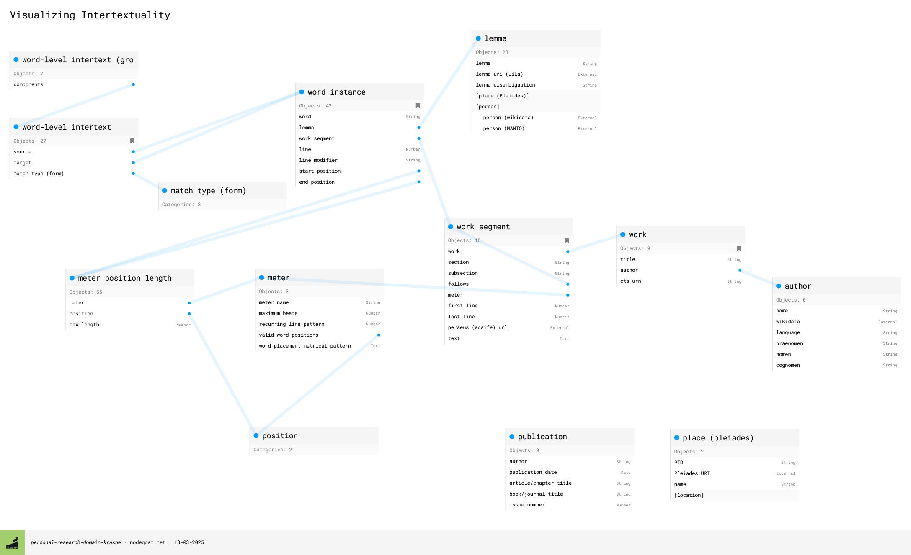

# Visualizing Intertextuality
## About the Project

## Background: What is Intertextuality?

Within the scholarly field of Latin poetry, &ldquo;intertextuality&rdquo; is a commonly-discussed concept. The term itself is commonly credited to the philosopher [Julia Kristeva](https://en.wikipedia.org/wiki/Julia_Kristeva), who first used it in two essays from the 1960s; its meaning, however&mdash;especially as it has come to be used, rather than as Kristeva originated it&mdash;is a source of debate across and within the academic fields that make use of the term. The present project is concerned with the following definition of intertextuality, as it is commonly used by most scholars who study Latin poetry.

Intertextuality refers to an allusive compositional technique whereby the writer of a text draws in language and imagery from earlier authors&rsquo; texts. In and of itself, this is a normal practice of almost any creative writing: intentionally or not, writers draw inspiration and even phrasing from earlier literature. However, within Latin (and, to a lesser extent, Greek) poetry, it is common for distinct, discrete phrases from earlier authors to serve almost as building blocks of later poetry, with an expectation that the earlier source and its context will be recognized. This form of reprocessing earlier poetry has come to be understood as an act of critical scholarship on the part of the poet, rather than as unimaginative borrowings and imitations, one that gives meaning to both the source (earlier) text and the target (later) text. (While I take the terms &ldquo;source&rdquo; and &ldquo;target&rdquo; from [Tesserae](https://tesserae.caset.buffalo.edu/), their use in network theory makes them especially apt here.) Additionally, poets often do not simply allude to a single earlier text in a given passage: they intertwine and overlay their allusions, in an approach that has been termed &ldquo;combinatorial&rdquo; ([Hardie 1990](#hardie1989)).

There are two slightly distinct, if largely overlapping, modes of multiple allusion that scholars have highlighted. One is commonly called &ldquo;window reference&rdquo; ([Thomas 1986](#thomas1986)), a term that describes the stacking of two or more related models through which each preceding model can be glimpsed. For instance, a passage in text A makes allusion to passages in earlier texts B, C, and D, which are themselves already related, in that A&rsquo;s most immediate model, B, also makes allusion to C, and C to D, and possibly also B to D. The passages need share no vocabulary for this type of allusion to be operative. The other mode, the aforementioned &ldquo;combinatorial imitation,&rdquo; is a more detail-oriented method that weaves together discrete words and phrases from disparate sources—sometimes related, but sometimes unrelated—into a single line or two. Here, shared lexemes or synonyms, or at least shared sound-patterns, are a base-level prerequisite. Currently, the latter is the only type of intertextuality that is dealt with by this project; it may expand to include the former at a later stage.

When intertexts are discussed in scholarship, they are often shown using typographical conventions, such as marking the words shared between two passages in a bold or italic font. For a limited number of intertexts, this suffices. For passages with a more complex set of intertexts behind them, however, or if a scholar wishes to discuss a set of intertexts that develops across several different texts, the limits of typography and comprehensibility are quickly reached:

<figure class="card">
<table>

<tr>
<td>
saeva sedens super arma et centum <i><u>vinctus</u> <b>a&euml;nis</b></i> (Verg. 1.295)
</td>
<td>
FUROR
</td>
</tr>

<tr>
<td>
atque <i style="border-bottom: 3px double;">adamanteis</i> discordia <i><u>vincta</u> catenis</i> (Man. 1.923)
</td>
<td>
DISCORDIA
</td>
</tr>

<tr>
<td>
abruptis Catilina minax <b><u>fractisque</u> catenis</b> (Luc. 6.793)
</td>
<td>
CATILINE
</td>
</tr>

<tr>
<td>
<i><u>vincla</u></i> Iovis <i><b><u>fractoque</u></b></i> trahens <i><b style="border-bottom: 3px double;">adamante</b> <b>catenas</b></i> (VF 3.225)
</td>
<td>
COEUS
</td>
</tr>

<tr>
<td colspan="2">
<span style="font-size:smaller;">N.B. sound echo in <i>vinctus <u>a&euml;nis</u></i> | <i>vincta c<u>a</u>t<u>enis</u></i></span>
</td>
</tr>

</table>
<figcaption>Example from a handout used at UCL&rsquo;s Flavian Intertextuality Day in December 2015.</figcaption>
</figure>

One need not understand Latin to see the words shared between the lines of poetry in the example above; and one need not understand Latin to recognize that any such approach is limited by constraints of practicality, legibility, and intelligibility.

## Considerations and Tools

This project asks how intertextuality can be displayed and comprehended through a visual, rather than textual, medium. The goal is to conceptualize and develop alternative methods of visualizing the intertextual richness and complexity of a given passage, starting from the assumption that such a visualization requires two different dimensions: one that shows the density of intertexts within a given passage, and one that shows the referential network arising around the passage. The structure of the data and its output should enable analytical approaches and questions, and the tools have been selected with these considerations in mind.

The data is stored in a [nodegoat](https://nodegoat.net/) [object-relational database](https://en.wikipedia.org/wiki/Object%E2%80%93relational_database). nodegoat was chosen for several reasons, including its humanities-oriented design, its ease of use, and its ability to expose the data as Linked Open Data. (While the open-source graph database [neo4j](https://neo4j.com/) was considered as an alternative option due to the intrinsic interconnectivity of intertextuality, the *relationship* and *structure* of that interconnectivity are also critical.) Use of nodegoat also avoids the need to host and serve the data, and it provides an API for access.

The choice of [Observable Framework](https://observablehq.com/framework/) for hosting the project was initially due to a piece of serendipity: [the nodegoat guide includes a demonstration of exporting data via the API to Observable](https://nodegoat.net/guide.s/150/export-data-to-observable), and the example visualization of letter-writing frequency somewhat resembled my mental image of what an intertextual density visualization might look like. While researching [Observable](https://observablehq.com/), I discovered its successor, Observable Framework, which offered several clear affordances: open source, highly customizable visualizations using [Observable Plot](https://observablehq.com/plot/) and [D3.js](https://d3js.org/), simultaneously static and reactive, automatic integration with GitHub, the ability to preload data, and the ability to write data loaders in any language. The customizability and the polyglot environment were initially the most appealing aspects, but the other benefits quickly became apparent.

## Methodology

### Database Design

There is currently no database of intertexts. Some benchmark datasets exist for the purpose of testing and training tools designed for detecting intertexts, notably [Dexter *et al.* (2024)](dexter2024), who provide a flat CSV file with 945 parallels (some comprised of multiple words) between the first book of Valerius Flaccus&rsquo; *Argonautica* and four other epics (one of which is approximately contemporary with the *Argonautica*, and three of which are earlier) that are recorded in three specific commentaries. This database, therefore, will itself provide a valuable resource and is accordingly designed with an eye both to future developments of the present project and to reuse by other scholars: not all of the entered data is used in the project as it currently stands. (It is important to note that one significant difference between this project&rsquo;s selection of intertexts and [Dexter *et al.* (2024)](dexter2024)&rsquo;s approach is that this project only includes parallels specifically identified as probable points of allusion, whereas they also include parallel *uses* of words, such as those where a commentator identifies another word-use that shares a similar unusual meaning.)

<figure>
<a href="https://pratt.darcykrasne.com/Portfolio/viz_intxt/nodegoat_model_2025-3-13.png"></a>
<figcaption>
The database model, as of 13 March 2025.
</figcaption>
</figure>

The critical core tables are `word instance`, `word-level intertext`, `word-level intertext (grouping)`, `author`, `work`, `work segment`, `meter`, and `meter position length`. Each `word instance` object represents a single word in a single line of a single poem; each `word-level intertext` object comprises a source word and a target word. Since intertexts are often made up of several words, a `word-level intertext (grouping)` object clusters these intertext pairings together, taking advantage of nodegoat&rsquo;s [&ldquo;multiple&rdquo; option](https://nodegoat.net/documentation.s/52/object-type). Words are not assigned directly to works, but to work segments. While that choice is due to ensuring that the database is in first normal form, the way the work segment is determined is due not just to conventional poetic divisions (such as books) but also to meter, because the basis of the intertextual density display is a grid whose width is determined by the meter of the piece. As many works are polymetric, the meter is assigned to the work segment, which can represent anything from an entire work (in the case of, e.g., an epyllion) to a single poem within a multi-book work (e.g., one of Statius&rsquo;s *Silvae*) or a passage of a drama (e.g., a section of a choral passage in a Senecan tragedy). A `word instance` is placed within a `work segment` by line number and by location within the line, based not on word order or syllable count but on metrical *sedes* (placement). (This decision was made both to accommodate textual variation and to enable the placement of words within the grid.) The placement is defined by the word&rsquo;s beginning and ending `meter position length` objects, which in turn specify the maximum number of beats that can be assigned to a given metrical position (as well as specifying which line of a stanza the position belongs to, for stichic meters): these ultimately govern the appearance of the word in the grid, but they also offer the future possibility of comparing the metrical placement of intertexts. (I am not going into detail here on some decisions regarding the calculation of metrical &ldquo;length&rdquo; or the properties of database objects because I hope to publish some of that information in due course; however, it will ultimately be available in some form.)

While the project overall is strictly concerned with Latin poetry, Greek texts also need to be included within the database due to Latin poetry&rsquo;s clear intertextual engagement with them. Accordingly, each author has a language property that specifies them as either a Greek or Latin author. While this does not allow for the possibility of bilingual authors, our surviving texts do not really compass this scenario, or do so insufficiently to justify putting the language label with works instead of authors. ([The Late Antique poet Claudian is one such counterexample](https://antigonejournal.com/2024/12/claudians-gigantomachia/), but he is so late that his works are unlikely to serve as the *source* of any intertexts in the database; and this is the only situation in which a Greek text can enter the database.)

Finally, each `word-level intertext` records at least one scholarly source (sometimes the original publication proposing the intertext, and sometimes a commentary), which are collectively stored in a `publication` table. This information is not currently displayed in any fashion, but it will eventually be available.

### Data Pipeline

#### Data Extraction and Transformation with Python

Every time the website is deployed (usually by an update on GitHub), a data loader written in Python performs an API call from nodegoat to fetch the current database model. It then extracts the nodegoat IDs for each object type table and does another API call for the individual objects. It assigns the objects, under their object types, to a dictionary, and then transforms them into dataframes, unpacking the highly nested information of the nodegoat JSON objects:

```python
# Create table dataframes
def table_to_df(table, cols_dict):
    dictlist = []
    for id in table:
        tdict = {}
        obj_defs = table[id]["object_definitions"]
        tdict["obj_id"] = id
        for key, val in cols_dict.items():
            # key becomes key in tdict
            id_val = list(val.keys())[0]
            if val[id_val] == "refid":
                try:
                    tdict[str(key)] = obj_defs[str(id_val)]["object_definition_ref_object_id"]
                except:
                    tdict[str(key)] = None
            elif val[id_val] == "objval":
                try:
                    tdict[str(key)] = obj_defs[str(id_val)]["object_definition_value"]
                except:
                    tdict[str(key)] = None
        dictlist.append(tdict)
    df = pd.DataFrame.from_dict(dictlist)

    # convert numeric IDs to string and remove any trailing decimals
    for col in df:
        if col[-3:] == "_id":
            df[col] = df[col].astype(str)
    def remove_decimal(id_string):
        if isinstance(id_string, str) and id_string[-2:] == ".0":
            return id_string[:-2]
        return id_string
    for col in df:
        if col[-3:] == "_id":
            df[col] = df[col].apply(remove_decimal)

    return df
```

It joins the disparate metrical data into a single dataframe and then returns it to a single restructured JSON object; and it converts each of the other dataframes to a JSON object, which are collectively stored in an array. These are all saved to files that are automatically committed to GitHub.

In the next stage of the project, the same Python data loader also creates network nodes and edges from the data. (This is [currently in progress](./sankey) as a [Sankey diagram](https://en.wikipedia.org/wiki/Sankey_diagram); I chose this over a traditional network graph since the sequential nature of an intertextual network makes it well-suited to visualizing as a flow-path.) While part of the network creation is done automatically by the d3 Sankey module, the initial preparation of nodes and edges is performed in the data loader.

<p><details>
<summary>Click to view the two custom functions for this stage.</summary>

```python
grp_intxts_list = [str(item) for sublist in list(word_lvl_intxt_grp_df.word_intxt_ids) for item in sublist]
intxt_grp_list = []

def build_intxt_dict(intxt_ids):
    for intxt in intxt_ids:
        intxt_id = str(intxt)
        for row2 in word_lvl_intxt_df[word_lvl_intxt_df.obj_id == intxt_id].iterrows():
            row_dict = {}
            if intxt_id in grp_intxts_list:
                row_dict["intxt_grp_id"] = intxt_grp_id
            else:
                row_dict["intxt_grp_id"] = None
            row_dict["intxt_id"] = intxt_id
            row2 = row2[1]
            source_id = row2.source_word_id
            target_id = row2.target_word_id
            if isinstance(row2.match_type_ids, list):
                match_type_ids = [str(id) for id in row2.match_type_ids]
            else:
                match_type_ids = []
            row_dict["source_word_id"] = source_id
            row_dict["target_word_id"] = target_id
            source_df = word_instance_df.copy().query(f"obj_id == '{source_id}'").reset_index(drop=True) \
                .merge(work_seg_df, how="left", left_on="work_segment_id", right_on="obj_id").drop("obj_id_y", axis=1) \
                .merge(work_df, how="left", left_on="work_id", right_on="obj_id")[['obj_id_x','word','work_segment_id', 'line_num','line_num_modifier',"work_id","author_id"]]
            target_df = word_instance_df.copy().query(f"obj_id == '{target_id}'").reset_index(drop=True) \
                .merge(work_seg_df, how="left", left_on="work_segment_id", right_on="obj_id").drop("obj_id_y", axis=1) \
                .merge(work_df, how="left", left_on="work_id", right_on="obj_id")[['obj_id_x','word','work_segment_id', 'line_num','line_num_modifier',"work_id","author_id"]]
            row_dict["source_author_id"] = source_df.loc[0,'author_id']
            row_dict["source_work_id"] = source_df.loc[0,'work_id']
            row_dict["source_work_seg_id"] = source_df.loc[0,'work_segment_id']
            if isinstance(source_df.loc[0,'line_num_modifier'], str):
                row_dict["source_line_num"] = str(source_df.loc[0,'line_num'])+source_df.loc[0,'line_num_modifier']
            else:
                row_dict["source_line_num"] = str(source_df.loc[0,'line_num'])
            row_dict["target_author_id"] = target_df.loc[0,'author_id']
            row_dict["target_work_id"] = target_df.loc[0,'work_id']
            row_dict["target_work_seg_id"] = target_df.loc[0,'work_segment_id']
            if isinstance(target_df.loc[0,'line_num_modifier'],str):
                row_dict["target_line_num"] = str(target_df.loc[0,'line_num'])+target_df.loc[0,'line_num_modifier']
            else:
                row_dict["target_line_num"] = str(target_df.loc[0,'line_num'])
            row_dict["match_type_ids"] = match_type_ids
            intxt_grp_list.append(row_dict)

for row in word_lvl_intxt_grp_df.iterrows():
    row = row[1]
    intxt_grp_id = row.obj_id
    intxt_ids = row.word_intxt_ids
    build_intxt_dict(intxt_ids)
build_intxt_dict([intxt for intxt in word_lvl_intxt_df.obj_id if intxt not in grp_intxts_list])

intxt_full_df = pd.DataFrame.from_dict(intxt_grp_list)

def prep_sankey(df):
    nodes_edges_dict = {}
    grp_df = df[~df.intxt_grp_id.isna()]
    no_grp_df = df[df.intxt_grp_id.isna()].drop("intxt_grp_id", axis=1)
    grp_ids = list(grp_df.intxt_grp_id.unique())
    no_grp_ids = list(no_grp_df.intxt_id.unique())
    nodes = []
    edges = []
    for work_seg in list(df.source_work_seg_id.unique()):
        author = df[df.source_work_seg_id == work_seg].reset_index(drop=True).loc[0,"source_author_id"]
        work = df[df.source_work_seg_id == work_seg].reset_index(drop=True).loc[0,"source_work_id"]
        nodes.append({"name": work_seg, "author": author, "work": work})
    # print(len(nodes))
    for work_seg in list(df.target_work_seg_id.unique()):
        if work_seg not in [item["name"] for item in nodes]:
            author = df[df.target_work_seg_id == work_seg].reset_index(drop=True).loc[0,"target_author_id"]
            work = df[df.target_work_seg_id == work_seg].reset_index(drop=True).loc[0,"target_work_id"]
            nodes.append({"name": work_seg, "author": author, "work": work})
    # print(len(nodes))
    # print(nodes)
    nodes_edges_dict["nodes"] = nodes
    def make_edge(id, df, grp=True):
        source = df.loc[0, "source_work_seg_id"]
        target = df.loc[0, "target_work_seg_id"]
        source_words = list(df.source_word_id.unique())
        target_words = list(df.target_word_id.unique())
        num_words = (len(source_words)+len(target_words))/2    # using average because sometimes multiple words are compressed into a single word or a single word is split into multiple words
        id = id
        if grp == True:
            group_id = True
        else:
            group_id = False
        edge_dict = {"source": source,
                     "target": target,
                     "source_words": source_words,
                     "target_words": target_words,
                     "num_words": num_words,
                     "id": id,
                     "group_id": group_id}
        return edge_dict
    for id in grp_ids:
        sub_df = grp_df.query(f"intxt_grp_id == '{id}'").reset_index(drop=True)
        edges.append(make_edge(id, sub_df))
    for id in no_grp_ids:
        sub_df = no_grp_df.query(f"intxt_id == '{id}'").reset_index(drop=True)
        edges.append(make_edge(id, sub_df, grp=False))
    # print(edges)
    nodes_edges_dict["edges"] = edges
    return nodes_edges_dict

sankey_data = prep_sankey(intxt_full_df)
```

</details></p>

#### Data Loading and Transformation with JavaScript

The remainder of the code is written in JavaScript, within an Observable Framework markdown document. After loading the data, the script defines several inputs for the choice of author, work, work section, and lines. Each is dependent on the selection made in the previous one, so that the data is progressively filtered.

<details>
<summary>Click to view the code for the Author, Work, and Work Section selectors</summary>

N.B. I have removed indications of separate code blocks from the following.

```js run=false
// Create authors dropdown

const authorList = [];
const authorTable = nodegoatTables.author_table;

for (let author in authorTable) {
	if (authorTable[author].language === "Latin") {
		const authorSet = [authorTable[author].author_name, authorTable[author].obj_id];
		authorList.push(authorSet);
	}
}

const authorPicker = Inputs.select(new Map([[null,null]].concat(authorList)), {label: "Select author:", value: null, sort: true});
const authorID = view(authorPicker);


// Create works dropdown

const workList = [];
const workTable = nodegoatTables.work_table;

for (let work in workTable) {
	if (workTable[work].author_id === authorID) {
		const workSet = [workTable[work].title, workTable[work].obj_id]
		workList.push(workSet);
	}
}

const workPicker = Inputs.select(new Map([[null, null]].concat(workList)), {label: "Select work:", value: null, sort: true});
const workID = view(workPicker);


// Create work section dropdown

const workSegList = [];
const workSegTable = nodegoatTables.work_seg_table;

for (let workSeg in workSegTable) {
	let workSegName;
	if (!workSegTable[workSeg].work_section) {	
		workSegName = "all"
	} else if (!workSegTable[workSeg].work_subsection) {
		workSegName = workSegTable[workSeg].work_section;
	} else {
		workSegName = workSegTable[workSeg].work_section + ', ' + workSegTable[workSeg].work_subsection;
	}
	
	if (workSegTable[workSeg].work_id === workID) {
		const workSegSet = [workSegName, workSegTable[workSeg].obj_id];
		workSegList.push(workSegSet);
	}
}

const workSegPicker = Inputs.select(new Map([[null, null]].concat(workSegList)), {label: "Select work section:", value: null, sort: true});
const workSegID = view(workSegPicker);
```

</details>

The creation of the two inputs for choosing the starting and ending lines for display required slightly more complex logic, as it needed to be based both on what was available to display in the chosen work section while also providing some default inputs.

<details>
<summary>Click to view the code for choosing the starting and ending lines</summary>

N.B. I have removed indications of separate code blocks from the following.

```js run=false
// Create necessary variables for chart display

const workSegVars = {
	workSegLineMin: 1,
	workSegLineMax: null,
	workSegMeterID: null
};

// Set variables for chart display, based on work segment chosen

for (let workSeg in workSegTable) {
	if (workSegTable[workSeg].obj_id === workSegID) {
		workSegVars.workSegLineMin = workSegTable[workSeg].first_line;
		workSegVars.workSegLineMax = workSegTable[workSeg].last_line;
		workSegVars.workSegMeterID = workSegTable[workSeg].meter_id;
		break;
	}
}

// Create number pickers for range of lines to display

const lineMinPicker = Inputs.number([workSegVars.workSegLineMin, workSegVars.workSegLineMax], 
									{step: 1, 
									label: "Select starting line: ", 
									value: workSegVars.workSegLineMin, 
									placeholder: workSegVars.workSegLineMin});
const startLine = view(lineMinPicker);

let tempMax = Math.min(workSegVars.workSegLineMin + 19, Math.max(workSegVars.workSegLineMin,workSegVars.workSegLineMax))

const lineMaxPicker = Inputs.number([workSegVars.workSegLineMin, workSegVars.workSegLineMax], 
									{step: 1, 
									label: "Select ending line: ", 
									value: tempMax, 
									placeholder: workSegVars.workSegLineMax});
const endLine = view(lineMaxPicker);

// Set default numbers

const lineRange = {
	firstLine: 1,
	lastLine: function() {return this.firstLine + 20;},
}


if (startLine > 0) {
	lineRange.firstLine = startLine;
}

if (endLine >= startLine) {
	lineRange.lastLine = endLine;
} else {lineRange.lastLine = lineRange.firstLine + 0;}

```

</details>

Once the passage is chosen, the script gathers any `word instance` that falls within the selected lines and then filters the `word level intertext` objects for those that include the relevant words as an intertext target. These are considered &ldquo;direct intertexts&rdquo;. It then collects any intertexts where the *source* of a direct intertext is the target, and so on; all of these are considered &ldquo;indirect intertexts&rdquo;. An empty grid is generated with `Plot.cell`, using the number of selected lines for its height and the relevant meter's maximum length for its width. Each cell of the grid is populated with the relevant word and intertext counts for that line and metrical position:

```js run=false
const intertextsArrComplete = [];

for (let line in lineArr) {
	for (let i in meterPosArr) {
		let intertextObj = {};
		intertextObj.lineNum = lineArr[line];
		intertextObj.linePos = meterPosArr[i];
		intertextObj.intxtCnt = 0;
		for (let posn in positions) {
			if (positions[posn].gridNums.includes(meterPosArr[i])) {
				intertextObj.linePosID = positions[posn].meter_pos_len_id;
				break;
			}
		}
		for (let word in wordsFiltered) {
			if (wordsFiltered[word].line_num === intertextObj.lineNum && wordsFiltered[word].posIDs.includes(intertextObj.linePosID)) {
				intertextObj.wordObj = wordsFiltered[word];
				intertextObj.intxtCnt = wordsFiltered[word].directIntertexts + wordsFiltered[word].indirectIntertexts;
				intertextObj.word = wordsFiltered[word].word;
			}
		}
		
		intertextsArrComplete.push(intertextObj);
	}
}

const intertextsArr = intertextsArrComplete.filter(pos => pos.word); // only include cells that have a word assigned to them
```

#### Visualization

The basic motivation was to make the display resemble the layout of the poem, while not showing information that doesn't exist. The background color was chosen to enable visibility of the palest values while still enabling contrast with all shades on the scale, including for individuals with color vision deficiencies.

For the Sankey diagram, the standard horizontal layout was rotated both to accommodate the future lengthening of the network and to convey a sense of the &ldquo;descent&rdquo; or &ldquo;inheritance&rdquo; analogy between earlier and later texts. The colors (which distinguish between authors) are currently drawn from the default [Tableau10](https://d3js.org/d3-scale-chromatic/categorical#schemeTableau10), but since there will eventually be repetitions once more than ten authors are in the database, they are reinforced by the inclusion of the author&rsquo;s name. I have also added a custom tool-tip popup for the nodes (and will subsequently do so for the links), since the default Sankey module only uses the HTML &lt;title&gt;, which does not render on all touch-screen devices:

```js run=false
if (Tt) {
    const nodeLabelG = node
        .append("g")
        .attr("class","node_label_group")
        .attr("transform", d => {
            const labelTranslate = +`-${(d.y1 - d.y0)/2}`;
            if (d.x0 < width / 2){
            return `translate(${(d.x0) +  5}, ${d.y0}) rotate(-90,0,0) translate(${labelTranslate},${d.x1 - d.x0})`
            }
            return `translate(${(d.x0 - 55)}, ${d.y0})  rotate(-90,0,0) translate(${labelTranslate},0)`
            })
        .attr("opacity","0")
        .attr("overflow","visible")
        .style('pointer-events', 'none');

    nodeLabelG.append("rect")
        .attr("height","50")
        .attr("width","130")
        .attr("stroke","black")
        .attr("fill","none")
        .attr("filter","drop-shadow(0 3px 4px rgba(0,0,0,.5))");

    const nodeLabelText = nodeLabelG.append("text")
            .attr("x","5")
            .attr("y",".5em")
            .attr("font-size","11")
            .attr("font-family","sans-serif")
            .attr("font-weight","normal")
            .attr("stroke","none")
            .attr("fill","black");

    nodeLabelText.append("tspan")
        .attr("dy","1em")
        .text((d,i) => {
            let authorID = origNodes[i].author;
            return lookupIDTable.get(authorID);
        });
    nodeLabelText.append("tspan")
        .attr("x","5")
        .attr("dy","1em")
        .attr("font-style","italic")
        .text((d,i) => {
            let workID = origNodes[i].work;
            return lookupIDTable.get(workID);});
    nodeLabelText.append("tspan")
        .attr("x","5")
        .attr("dy","1em")
        .text((d,i) => Tt[i].split("\n")[1]); 

    nodeRect
        .on("mouseover", function(event) {
            d3.select(this).attr("opacity","1");
            d3.select(this.nextSibling.nextSibling)
                .attr("opacity","1")
            d3.select(this.nextSibling.nextSibling.firstChild)
                .attr("fill","white")
        })
        .on("mouseout", function(event) {
                d3.select(this).attr("opacity",".6");
                d3.select(this.nextSibling.nextSibling)
                .attr("opacity","0")
            d3.select(this.nextSibling.nextSibling.firstChild)
                .attr("fill","none")});
}

svg.selectAll(".node")
    .on("mouseover", function(event) {
        d3.select(this).raise();
    })
```


## Next Steps

Currently underway are the entry of additional intertexts into the database and the creation of an intertextuality network from the selected word, using [D3.js](https://d3js.org/), as described above. Following that, in addition to continuing database input, attention will focus on providing a display of what the intertexts are, as well as tweaking the code to handle elisions, extranumerical lines (such as 845a, which would come between 845 and 846), and alternative readings. A few additional potential long-term developments are:

- an option to view only direct intertext density
- an option to view &ldquo;descendant&rdquo; intertexts instead of &ldquo;ancestor&rdquo; intertexts
- collaboration with projects on automated detection of text reuse (such as [Tesserae](https://tesserae.caset.buffalo.edu/) or [F&#x012b;lum](http://tools.qcrit.org/filum)) to enhance the database, with a reduction of manual labor

Other requests and suggestions for future development are welcome [at the GitHub page](https://github.com/dkrasne/visualizing_intertextuality).

## Bibliography

<ul>
<li id="dexter2024">Dexter, J.P., Chaudhuri, P., Burns, P.J., Adams, E.D., Bolt, T.J., Cásarez, A., Flynt, J.H., Li, K., Patterson, J.F., Schwartz, A., Shumway, S. (2024) &ldquo;A Database of Intertexts in Valerius Flaccus&rsquo; Argonautica 1: A Benchmarking Resource for the Evaluation of Computational Intertextual Search of Latin Corpora,&rdquo; <i>Journal of Open Humanities Data</i> 10:14, 1–7. <a href="https://doi.org/10.5334/johd.153">doi: 10.5334/johd.153</a></li>
<li id="hardie1989">Hardie, P. R. (1989) &ldquo;Flavian Epicists on Virgil’s Epic Technique,&rdquo; <i>Ramus</i> 18: 3–20.</li>
<li id="thomas1986">Thomas, R.F. (1986) &ldquo;Virgil&rsquo;s Georgics and the Art of Reference,&rdquo; <i>Harvard Studies in Classical Philology</i> 90: 171–98.</li>
</ul>

## Appendix: Getting Started with Observable Framework

In learning how to use Framework and setting up my site, I encountered a few snags with the default installation setup and automated deployment via GitHub, which I document here for others who may encounter the same issues.

1. First, while following the [Learn Observable Guide](https://observablehq.observablehq.cloud/learn-observable-guide/), I kept running into an error that claimed I didn't have Python installed when I tried to use a data loader that I had written in Python. [The problem turned out to be](https://github.com/observablehq/framework/issues/1927) that my computer runs Python with `python` rather than `python3`, and the latter is the only possibility recognized by the `observablehq.config.js` file. The solution is to add the following to the end of the file, just before the closing `};`:

```js run=false
// MODIFY LIST OF INTERPRETERS:
  interpreters: {
	".py": ["python"]
  },
```

2. Second, after setting up [an automated deployment using GitHub Actions every time I pushed changes to GitHub](https://observablehq.com/framework/deploying#automated-deploys), I encountered two problems. First, because I was importing a couple of packages in my Python data loader, I was getting an error message when running the build that the package wasn't found, [a problem that had already been documented and solved here](https://talk.observablehq.com/t/github-actions-with-pandas-data-loader-on-observable-framework/9309). But even after following the documented steps, I continued to get the error message, and GitHub was telling me that the deploy had failed, but without an *actual* failure (i.e., the site was correctly updating on Observable Framework). The solution was to *also* add a new line to Framework's `package.json` file:

```json
# ...
"observable": "observable",
"install": "pip install -r requirements.txt"
#...
```

3. Third, when using GitHub Actions and a deploy.yml script for an automated deploy, any API keys need to be added to both Observable Framework secrets *and* GitHub Secrets, as well as adding them in the build step of the `deploy.yml` script:

```yaml
- run: npm run build
  env:
    NODEGOAT_API_TOKEN: ${{ secrets.NODEGOAT_API_TOKEN }}
```

4. Fourth, I needed my data loader to produce multiple files, not just the one it's intended to produce at the end, due to needing to limit my API calls (I have enough tables to retrieve from nodegoat that I can only call the full set of them once every fifteen minutes). This was in itself not a problem, but the files weren't storing themselves successfully on GitHub. I ultimately discovered ([with the aid of ChatGPT to get the exact correct format](https://chatgpt.com/share/67dc1153-1adc-800d-9680-c00477d2fa85)) that I needed to add yet another step to my `deploy.yml` script; and I also need to add a GitHub token to both the build step and the new commit/push step, so that this portion of the script looked as follows:

```yaml
- run: npm run build
  env:
    NODEGOAT_API_TOKEN: ${{ secrets.NODEGOAT_API_TOKEN }}
    GITHUB_TOKEN: ${{ secrets.GITHUB_TOKEN }}
- name: Commit and Push Changes
  run: |
    git config --global user.name "GitHub Actions"
    git config --global user.email "actions@github.com"
    git add .
    git diff --quiet && git diff --staged --quiet || git commit -m "Auto-update model_json_backup.json and objects_json_backup.json"
    git push
  env:
    GITHUB_TOKEN: ${{ secrets.GITHUB_TOKEN }}
```
